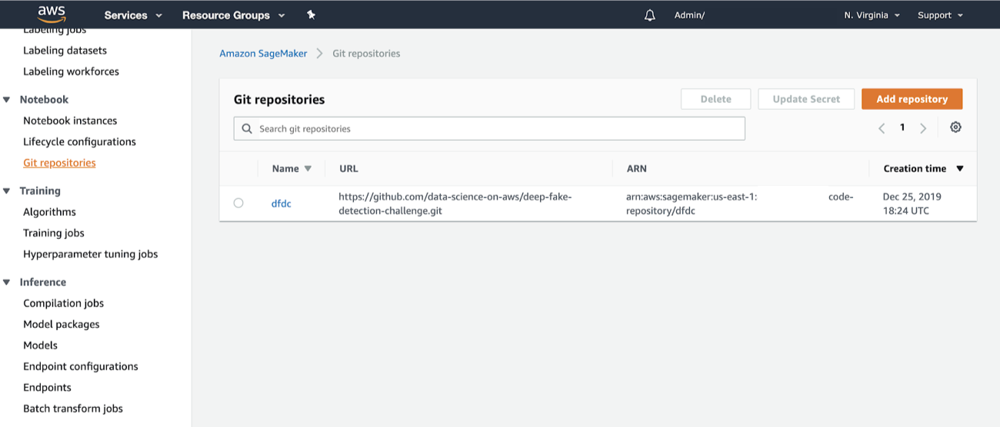
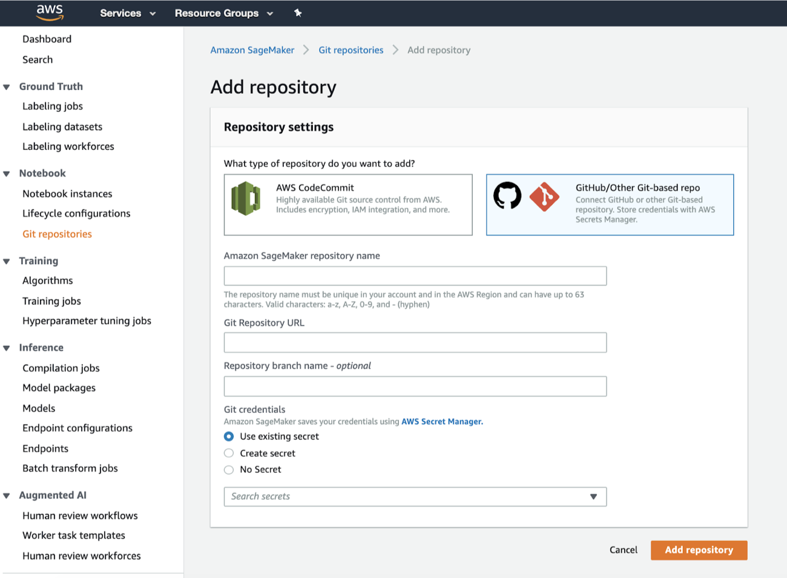
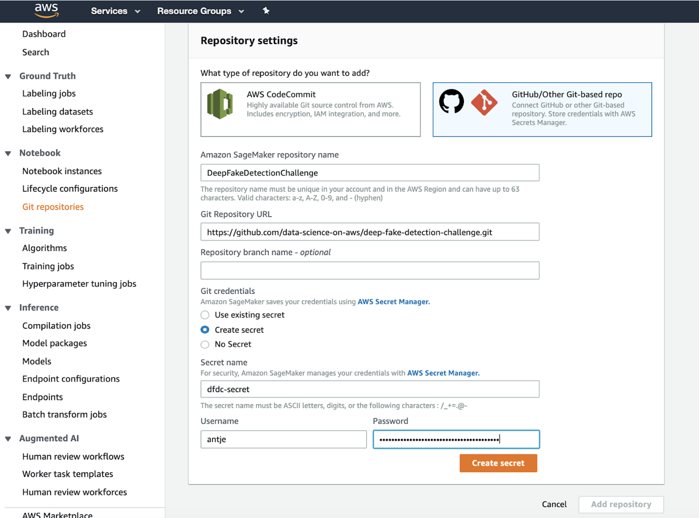
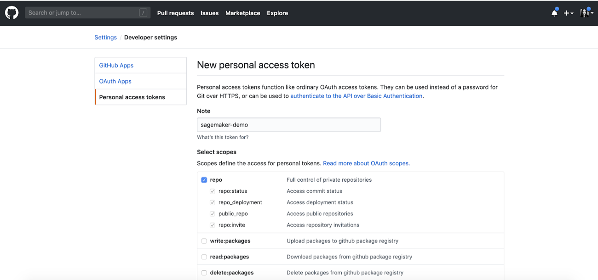
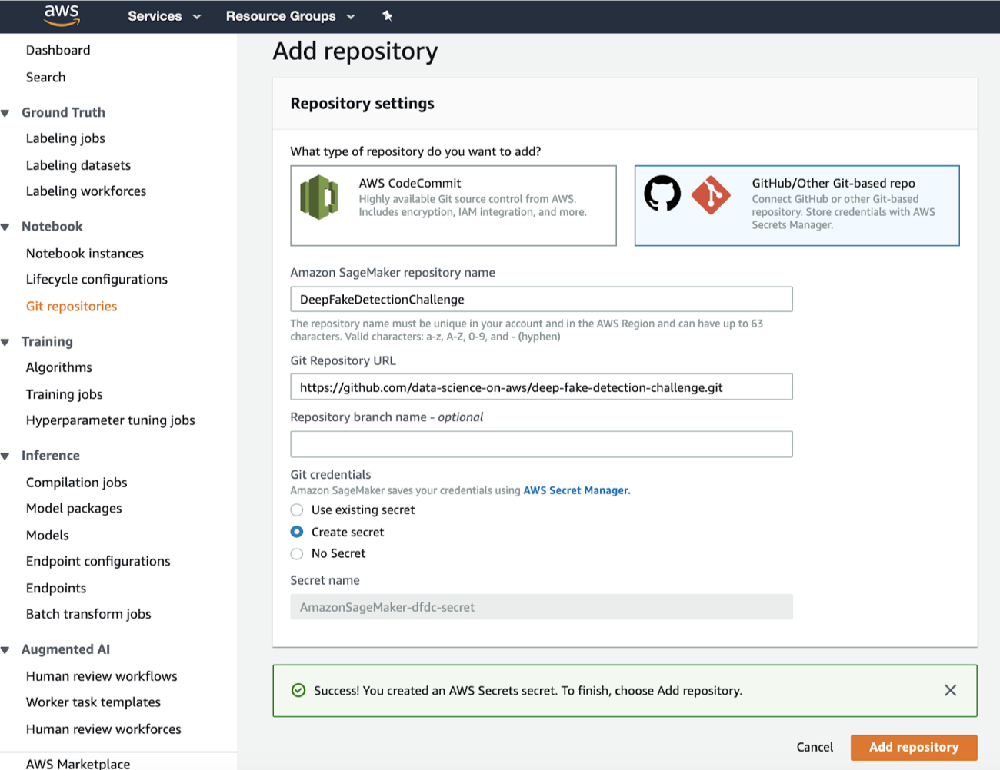
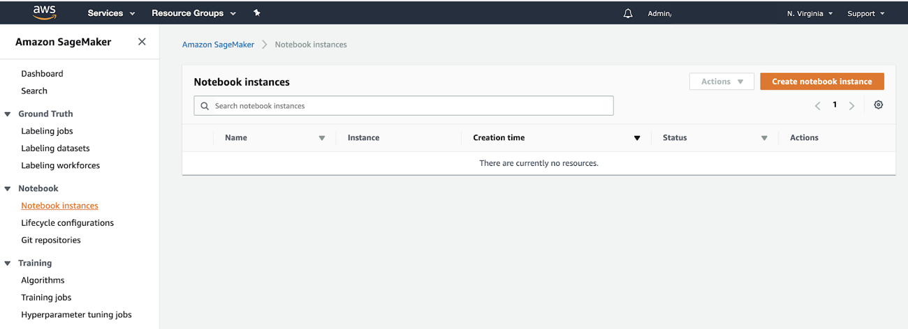
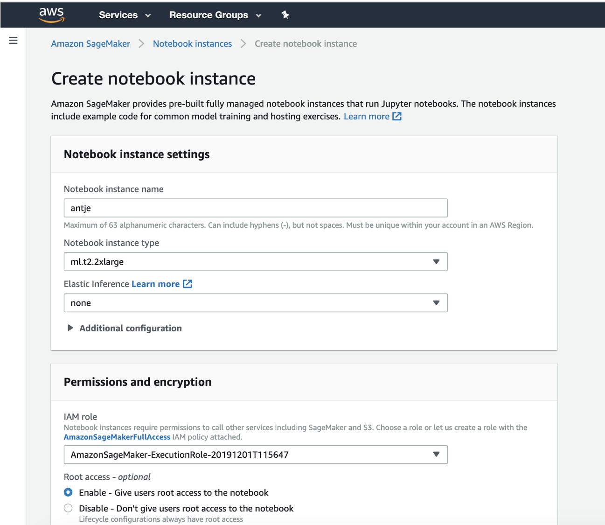
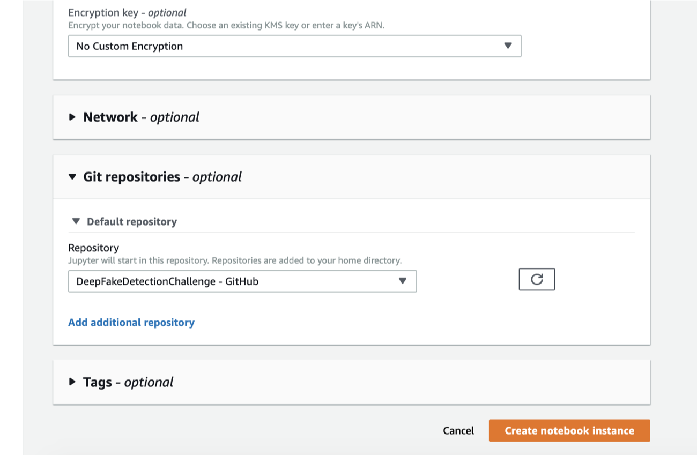
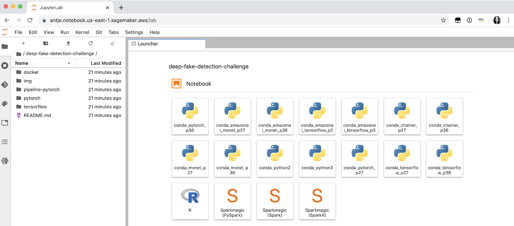

# Amazon SageMaker <> Git Integration

See also: 

https://docs.aws.amazon.com/sagemaker/latest/dg/nbi-git-repo.html

https://aws.amazon.com/blogs/machine-learning/git-integration-now-available-for-amazon-sagemaker-python-sdk/

## 1. Go to the Amazon SageMaker console, and click on Git repositories > Add repository

## 2. Select GitHub/Other Git-based repo

### Provide the following information: 
* Amazon SageMaker repository name >> any repo name
* Git Repository URL >> URL to your repo
* Git credentials >> Create secret

* For Password, generate Github Personal Access Token with the relevant permissions:

* Add repository:

## 3. Create Amazon SageMaker Jupyter instance & attach Git

* Create notebook instance

* Select previously created Git repo

* Create notebook instance

## 4. Login to Jupyter instance

